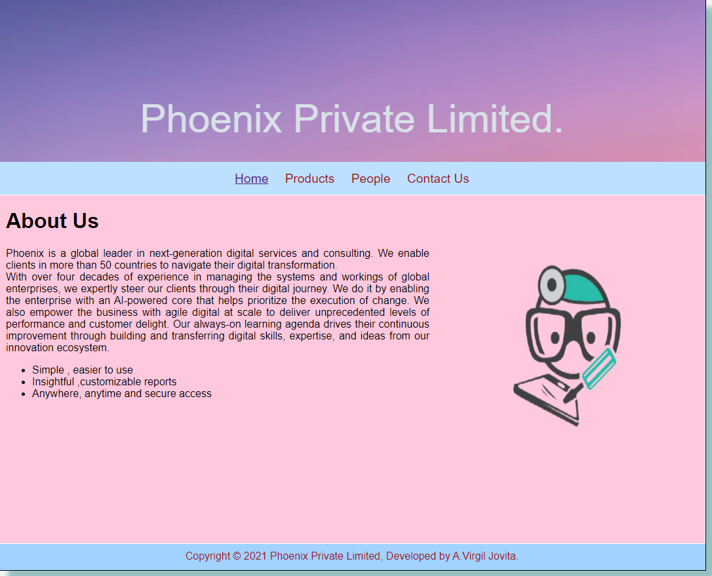
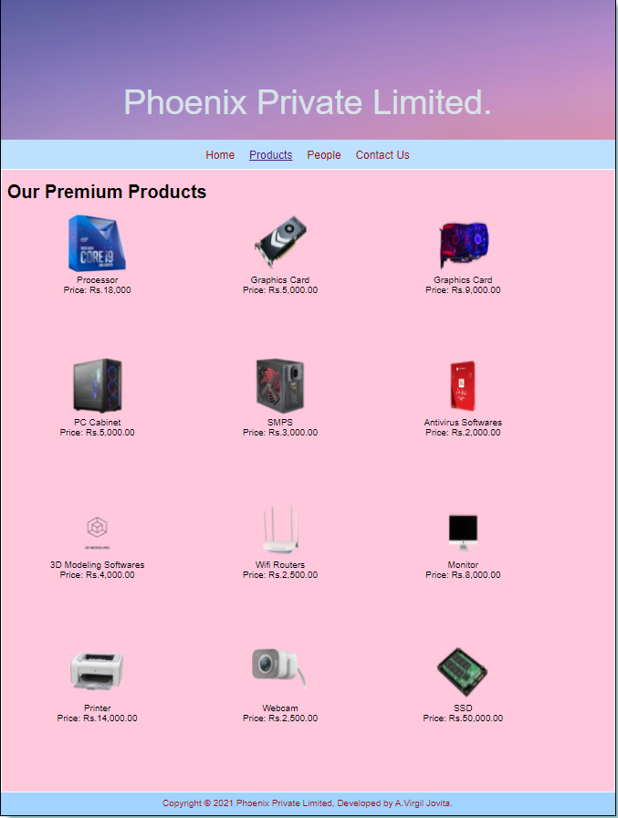
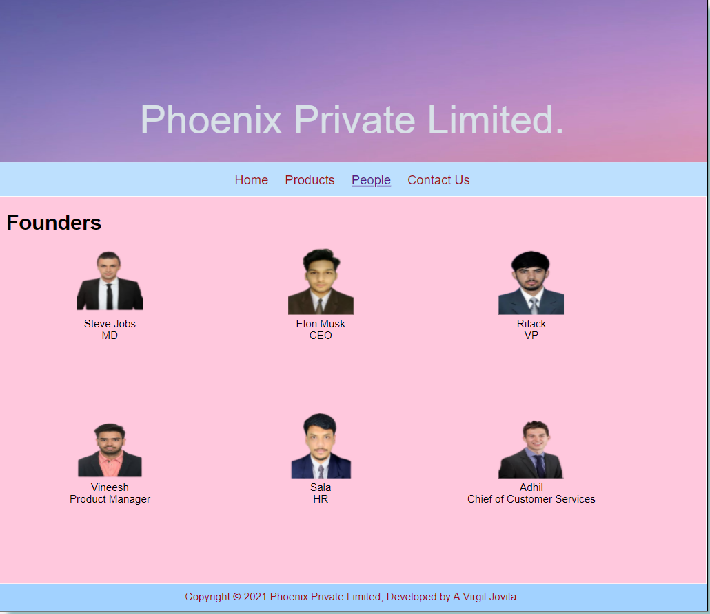
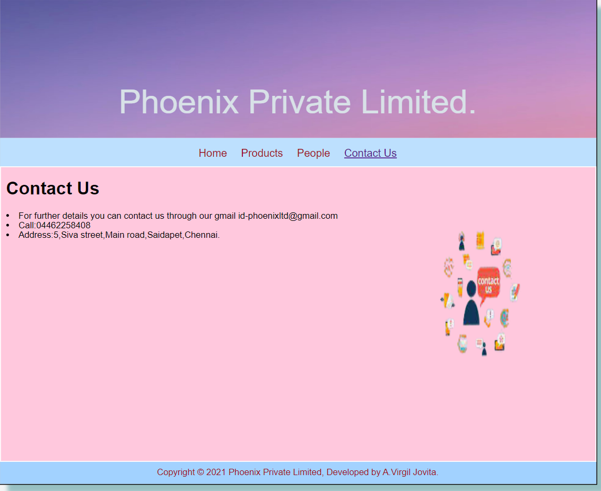

# Web Design for a Software Product Company

## AIM:

To design a static website for a software product company company.

## DESIGN STEPS:

### Step 1:

Requirement collection.

### Step 2:

Creating the layout using HTML and CSS.

### Step 3:

Updating the sample content.

### Step 4:

Choose the appropriate style and color scheme.

### Step 5:

Validate the layout in various browsers.

### Step 6:

Validate the HTML code.

### Step 6:

Publish the website in the given URL.

## PROGRAM :
### home page:
```
<!DOCTYPE html>
<html lang="en">
  <head>
    <title>Phoenix Private Limited</title>
    <link rel="stylesheet" href="./css/layout.css" />
    <link rel="icon" href="./img/cont.jpg" type="image/x-icon" />
  </head>

  <body>
    <div class="container">
      <div class="banner">Phoenix Private Limited.</div>
      <div class="menu">
        <div class="menuitemselected"><a href="/static/home.html">Home</a></div>
        <div class="menuitem"><a href="/static/products.html">Products</a></div>
        <div class="menuitem"><a href="/static/people.html">People</a></div>
        <div class="menuitem"><a href="/static/contact.html">Contact Us</a></div>
      </div>
      <div class="content">
        <div class="homecontent">
          <h1>About Us</h1>
          
          <div class="contenttext">
            Phoenix is a global leader in next-generation digital services and consulting. We enable clients in more than 50 countries to navigate their digital transformation.
            <br />
            With over four decades of experience in managing the systems and workings of global enterprises, we expertly steer our clients through their digital journey. We do it by enabling the enterprise with an AI-powered core that helps prioritize the execution of change. We also empower the business with agile digital at scale to deliver unprecedented levels of performance and customer delight. Our always-on learning agenda drives their continuous improvement through building and transferring digital skills, expertise, and ideas from our innovation ecosystem.
            <ul>
              <li>Simple , easier to use</li>
              <li>Insightful ,customizable reports</li>
              <li>Anywhere, anytime and secure access</li>
            </ul>
          </div>
        </div>
      </div>
      <div class="footer">
        Copyright &#169; 2021 Phoenix Private Limited, Developed by A.Virgil Jovita.
      </div>
    </div>
  </body>
</html>

```
### products page:
```
<!DOCTYPE html>
<html lang="en">
  <head>
    <title>Phoenix Private Limited</title>
    <link rel="stylesheet" href="./css/layout.css" />
    <link rel="icon" href="./img/icon.png" type="image/x-icon" />
  </head>

  <body>
    <div class="container">
      <div class="banner">Phoenix Private Limited.</div>
      <div class="menu">
        <div class="menuitem"><a href="/static/home.html">Home</a></div>
        <div class="menuitemselected"><a href="/static/products.html">Products</a></div>
        <div class="menuitem"><a href="/static/people.html">People</a></div>
        <div class="menuitem"><a href="/static/contact.html">Contact Us</a></div>
      </div>
      <div class="content">
        <div class="productcontent">    
          <h1>Our Premium Products</h1>
          <div class="productitems">
              <div class="productitem"> 
                  <div class="itemimage">
                  
                  </div>
                  <div class="itemname">Processor</div>
                  <div class="itemprice">Price: Rs.18,000 </div>
              </div>
              <div class="productitem"> 
                  <div class="itemimage">
                  
                  </div>
                  <div class="itemname">Graphics Card</div>
                  <div class="itemprice">Price: Rs.5,000.00 </div>
              </div>
              <div class="productitem"> 
                  <div class="itemimage">
                  
                  </div>
                  <div class="itemname">Graphics Card</div>
                  <div class="itemprice">Price: Rs.9,000.00 </div>
              </div>
              <div class="productitem"> 
                  <div class="itemimage">
                  
                  </div>
                  <div class="itemname">PC Cabinet</div>
                  <div class="itemprice">Price: Rs.5,000.00 </div>
              </div>
              <div class="productitem"> 
                  <div class="itemimage">
                  
                  </div>
                  <div class="itemname">SMPS</div>
                  <div class="itemprice">Price: Rs.3,000.00 </div>
              </div>
              <div class="productitem"> 
                  <div class="itemimage">
                  
                  </div>
                  <div class="itemname">Antivirus Softwares</div>
                  <div class="itemprice">Price: Rs.2,000.00 </div>
              </div>
              <div class="productitem"> 
                  <div class="itemimage">
                  
                  </div>
                  <div class="itemname">3D Modeling Softwares</div>
                  <div class="itemprice">Price: Rs.4,000.00 </div>
              </div>
              <div class="productitem"> 
                  <div class="itemimage">
                  
                  </div>
                  <div class="itemname">Wifi Routers</div>
                  <div class="itemprice">Price: Rs.2,500.00 </div>
              </div>
              <div class="productitem"> 
                 <div class="itemimage">
                 
                 </div>
                 <div class="itemname">Monitor</div>
                 <div class="itemprice">Price: Rs.8,000.00 </div>
              </div>
              <div class="productitem"> 
                  <div class="itemimage">
                  
                  </div>
                  <div class="itemname">Printer</div>
                  <div class="itemprice">Price: Rs.14,000.00 </div>
              </div>
              <div class="productitem"> 
                <div class="itemimage">
                
                </div>
                <div class="itemname">Webcam</div>
                <div class="itemprice">Price: Rs.2,500.00 </div>
              </div>
              <div class="productitem"> 
              <div class="itemimage">
              
              </div>
              <div class="itemname">SSD</div>
              <div class="itemprice">Price: Rs.50,000.00 </div>
              </div>
             </div>
          </div>       
      </div>
      <div class="footer">
        Copyright &#169; 2021 Phoenix Private Limited, Developed by A.Virgil Jovita.
      </div>
    </div>
  </body>
</html>

```
### people page:
```
<!DOCTYPE html>
<html lang="en">
  <head>
    <title>Phoenix Private Limited</title>
    <link rel="stylesheet" href="./css/layout.css" />
    <link rel="icon" href="./img/icon.png" type="image/x-icon" />
  </head>

  <body>
    <div class="container">
      <div class="banner">Phoenix Private Limited.</div>
      <div class="menu">
        <div class="menuitem"><a href="/static/home.html">Home</a></div>
        <div class="menuitem"><a href="/static/products.html">Products</a></div>
        <div class="menuitemselected"><a href="/static/people.html">People</a></div>
        <div class="menuitem"><a href="/static/contact.html">Contact Us</a></div>
        </div>
      <div class="content">
        <div class="productcontent">    
          <h1>Founders</h1>
          <div class="productitems">
              <div class="productitem"> 
                  <div class="itemimage">
                  
                  </div>
                  <div class="itemname">Steve Jobs</div>
                  <div class="itemprice">MD</div>
              </div>
              <div class="productitem"> 
                  <div class="itemimage">
                  
                  </div>
                  <div class="itemname">Elon Musk</A></div>
                  <div class="itemprice">CEO</div>
              </div>
              <div class="productitem"> 
                <div class="itemimage">
                
                </div>
                <div class="itemname">Rifack</div>
                <div class="itemprice">VP</div>
            </div>
            <div class="productitem"> 
                <div class="itemimage">
                
                </div>
                <div class="itemname">Vineesh</div>
                <div class="itemprice">Product Manager</div>
            </div>
            <div class="productitem"> 
                <div class="itemimage">
                
                </div>
                <div class="itemname">Sala</div>
                <div class="itemprice">HR</div>
            </div>
            <div class="productitem"> 
                <div class="itemimage">
                
                </div>
                <div class="itemname">Adhil</div>
                <div class="itemprice">Chief of Customer Services</div>
            </div>
          </div>
          </div>        
      </div>
      <div class="footer">
        Copyright &#169; 2021 Phoenix Private Limited, Developed by A.Virgil Jovita.
      </div>
    </div>
  </body>
</html>

```
### contact us:
```
<!DOCTYPE html>
<html lang="en">
  <head>
    <title>Phoenix Private Limited</title>
    <link rel="stylesheet" href="./css/layout.css" />
    <link rel="icon" href="./img/cont.png" type="image/x-icon">
  </head>

  <body>
    <div class="container">
      <div class="banner">Phoenix Private Limited.</div>
      <div class="menu">
        <div class="menuitem"><a href="/static/home.html">Home</a></div>
        <div class="menuitem"><a href="/static/products.html">Products</a></div>
        <div class="menuitem"><a href="/static/people.html">People</a></div>
        <div class="menuitemselected"><a href="/static/contact.html">Contact Us</a></div>
      </div>
      <div class="content">
        <div class="homecontent">
          <h1>Contact Us</h1>
          
          <div class="contenttext">
              <u1>
                  <li>For further details you can contact us through our gmail id-phoenixltd@gmail.com</li>
                 <li>Call:04462258408</li>
                 <li>Address:5,Siva street,Main road,Saidapet,Chennai.</li>
             </ul>
          </div>
        </div>
      </div>
      <div class="footer">
        Copyright &#169; 2021 Phoenix Private Limited, Developed by A.Virgil Jovita.
      </div>
    </div>
  </body>
</html>

```

## OUTPUT:

### Home Page:



### Product Page:



### People Page:  



### Contact Us:




## Result:

Thus a website is designed for the software product company and the HTML,CSS code are validated.
